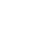

# Документація вебдодатку Placid

## Посилання на додаток

###  <a style="font-size: 30px" href="https://placid.live">Placid</a>

## Використані бібліотеки

- [Material UI](https://mui.com/material-ui/)
- [Material UI Icons](https://mui.com/material-ui/material-icons/)
- [React Router ](https://www.npmjs.com/package/react-router)
- [React Firebase](https://www.npmjs.com/package/react-firebase)
- [React Firebase Hooks](https://www.npmjs.com/package/react-firebase-hooks)

## Компоненти

> 404

       404.js

> aboutAuthorPage

       AboutTheAuthor.js

       AboutTheAuthor.css

> chatFieldUI

       PlacidChatField.js

> chatListUI

       ChatList.js

       ChatList.css

> firebaseConfiguration

       FirebaseConfig.js

> header

       Header.js

       Header.css

> img

       AmpliLogo.svg

       Logo.svg

> inputFieldUI

       InputField.js

       InputField.css

> loader

       Loader.js

       Loader.css

> massageUI

       Message.js

       Message.css

> signInPage

       SignInWindow.js

       SignInWindow.css

> userMenu

        UserMenu.js

        UserMenu.css

## Використане API

Для роботи додатка використовується **Firebase Realtime Database**, для доступа до якого використовується масив такого виду:

```js
const firebaseConfig = {
  apiKey: "",
  authDomain: "",
  databaseURL: "",
  projectId: "",
  storageBucket: "",
  messagingSenderId: "",
  appId: "",
};
```

Цей сервіс дозволяє записувати і зчитувати дані з бази даних.

## Використані довідкові джерела

- [Material UI Official Site](https://mui.com/material-ui/)
- [Firebase DOCS](https://firebase.google.com/docs/build)

## Про автора

**Ім'я**: `Alex_K`

**Вік**: `15`
